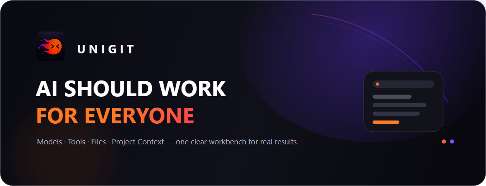

<div align="center">
  
</div>

<p align="center">
  <a href="https://unigit.ai/"><strong>官方网站</strong></a>
  ·
  <a href="https://unigit.ai/download/"><strong>获取 UNIGIT</strong></a>
  ·
  <a href="./docs/VISION.md"><strong>愿景与价值观</strong></a>
  ·
  <a href="./docs/ECOSYSTEM.md"><strong>生态合作</strong></a>
</p>

<p align="center">
  
  
  
</p>

## AI 不该只属于会折腾的人

UNIGIT 是面向真实工作的 AI 智能工作台。

我们希望把模型、工具、文件与项目上下文放进一个清晰的工作环境里：用户只需要表达想完成什么，模型可以根据现场情况选择路径、调用工具、处理文件，并把结果真实交付回来。

**不用先研究模型会员，不用理解 API，也不用学习一套复杂的“AI 工作流”。打开，说明目标，开始工作。**

> 从“我听说 AI 能做到”，到“我现在就能完成”。

## 不只是聊天，而是把事情做完

很多 AI 产品停在回答问题。UNIGIT 更关心回答之后发生了什么：

| 用户真正需要的 | UNIGIT 关注的体验 |
| --- | --- |
| 选择合适的模型 | 用智能路由降低选择成本，同时允许用户保留自己的模型偏好 |
| 完成复杂任务 | 给模型稳定、语义清晰的工具和真实环境反馈，而不是规定死流程 |
| 处理真实资料 | 让文档、表格、演示、图片与项目文件进入同一个任务上下文 |
| 拿到可用成果 | 文件必须真实存在、可以预览、打开、保存和继续修改 |
| 任务不中断 | 供应线路异常时尽量切换，保留上下文、状态和已完成成果 |
| 清楚花了多少 | 把调用、成本、状态和结果记明白，不用复杂门禁阻碍工作 |

## 我们相信的工作方式

UNIGIT 不负责命令模型“必须先做 A，再做 B，再做 C”。UNIGIT 应该负责：

- 提供稳定、简单、一目了然的工具；
- 告诉模型当前有哪些资源、权限和现实限制；
- 把系统、文件、浏览器与执行环境的真实反馈交给模型；
- 记录成本、状态与结果；
- Provider 出问题时切线，而不是无意义地把任务毙掉；
- 把上下文和项目状态交接好，让工作可以继续。

换句话说：**薄 Harness、宽兼容、强工具、真实交付。**

## 这个公开仓库是什么

这是 UNIGIT 的**公开品牌与生态入口**，不是产品核心源码仓库。

这里用于：

- 介绍 UNIGIT 的产品方向、愿景与价值观；
- 发布适合公开的品牌资料、生态说明和无敏感性的示例；
- 收集值得接入的模型、工具、MCP、Skill、模板和知识资源；
- 让能力开发者、供应商、行业专家与合作伙伴找到清晰入口；
- 逐步发布稳定、可公开、不会暴露产品核心的扩展契约。

这里**不会**包含：模型路由、计费、供应链、服务端、管理端、桌面执行器、内部 Harness、私有工具实现、商业策略、密钥、生产配置、客户数据或私有仓库历史。详见 [公开边界](./docs/OPEN_SOURCE_SCOPE.md)。

## 我们正在寻找什么

如果你拥有或维护下面这些资源，欢迎通过 Issue 与我们建立联系：

- 可稳定服务真实任务的模型与推理资源；
- 实用的 MCP、工具、Skill 与自动化能力；
- 文档、设计、研发、研究、数据与行业场景能力；
- 可合法使用的知识资源、数据连接器和模板；
- 对普通用户真正友好的产品、渠道与生态合作；
- 愿意参与早期试用、共创和反馈的真实用户。

👉 [推荐一项资源](../../issues/new?template=resource.yml) · [提出合作意向](../../issues/new?template=partnership.yml)

## 面向不同伙伴的价值

### 对用户

更少配置、更少来回切换，让 AI 从“会说”走向“能做”。

### 对能力开发者

把有价值的工具、模板和专业能力带到真实任务现场，并获得清晰的展示与合作入口。

### 对模型与基础设施伙伴

用统一工作台连接真实用户需求，让模型能力在文件、工具与持续任务里被真正使用。

### 对行业与渠道伙伴

共同把 AI 带给过去没有时间、技术背景或采购能力的人群，形成可持续的服务与商业价值。

## 产品与生态方向

```text
今天：让模型在清晰的工作台里调用工具、处理文件、交付成果
  ↓
接下来：让缺失能力可以被发现、授权、安装，并在同一任务中投入工作
  ↓
未来：能力商店 × 知识库 × 智能工作台，形成面向真实工作的开放生态
```

这些是方向，不是对发布日期或具体功能的承诺。当前可用范围请以 [官方网站](https://unigit.ai/) 和正式发布说明为准。

## 参与方式

1. 先阅读 [生态合作说明](./docs/ECOSYSTEM.md) 和 [公开边界](./docs/OPEN_SOURCE_SCOPE.md)。
2. 通过结构化 Issue 推荐资源或说明合作意向；请勿提交密钥、客户数据或未获授权的内容。
3. 适合公开沉淀的材料可以发起 Pull Request；产品核心与商业敏感能力不在本仓讨论或接收。

## English

**UNIGIT is an AI workbench built for real work.** It brings models, tools, files, and project context into one clear environment so people can describe the outcome they want and receive a real, usable result. This repository is the public brand and ecosystem hub—not the source repository of UNIGIT's proprietary runtime.

Visit [unigit.ai](https://unigit.ai/) to learn more.

---

<p align="center">
  <strong>别再围观 AI，开始使用 AI。</strong><br />
  <sub>UNIGIT · 让每一个普通人真正用上 AI</sub>
</p>
